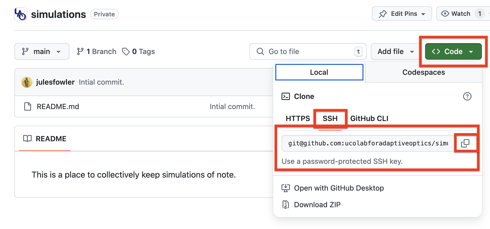
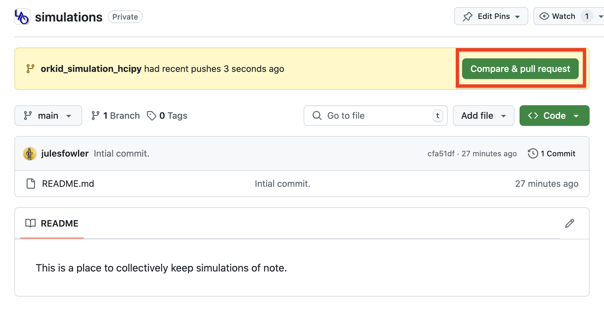
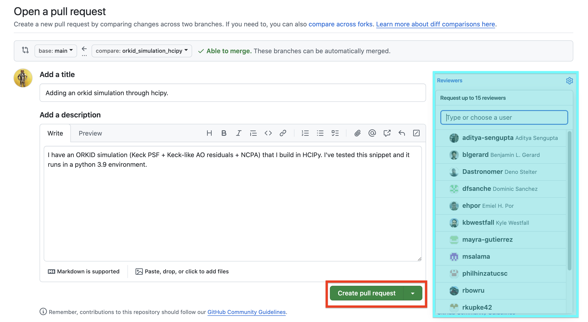
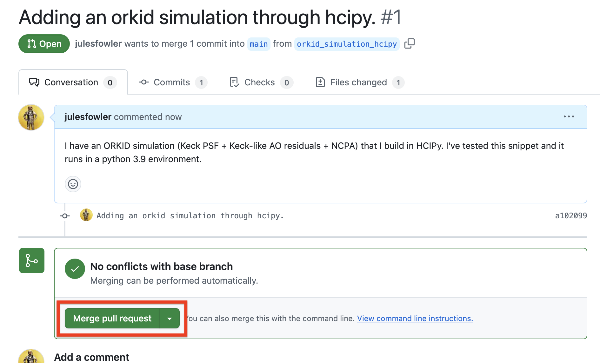

I have a nice little snippet of code that simulates ORKID. (Essentially the Keck
aperture, Keck-like AO residuals, and enough NCPA hand-tweaked to match the
ORKID PSF.) Maybe this or adapting it will be helpful for other folks in their
simulations! So I'm adding it to the ``simulations`` repository in the LAO
github. 

First I need to clone that repository on my computer. If I go to the
``simulations`` repository page on the LAO GitHub it will give me a handy button
to copy the link to that repository. (Note that if you have `ssh` set up on your
machine you'll want to use the SSH key option.) 

Now I can clone it on my local machine: 

>> git clone git@github.com:ucolabforadaptiveoptics/simulations.git

Once I ``cd`` into that repository I have a local copy of everything on GitHub.
I'm using a branch workflow here, and I'll make a branch called
``orkid_simulation_hcipy``. 

>> git checkout -b orkid\_simulation\_hcipy 

Now I can copy or move my snippet into the repo. (I tested it to make sure it
runs as I expect to make sure I'm not committing broken code.) And I can add and
commit it to the repository. 

>> git add orkid\_simulation\_hcipy.py
>> git commit -m "Adding an orkid simulation through hcipy."

Finally, I can push this back to the repo, because of the branch workflow I will
need to specify the branch. 

>> git push origin orkid\_simulation\_hcipy 

Now on the GitHub side, a badge will pop up on the repo asking me to open a pull
request (PR). 

I can open a PR, leave a little more information about what this is (if this were a more complicated piece of code it would be a good idea to ask for
a review and have someone else look at it, but that's probably overkill for this
case)

and merge the PR. 

