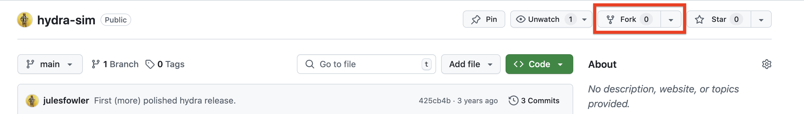
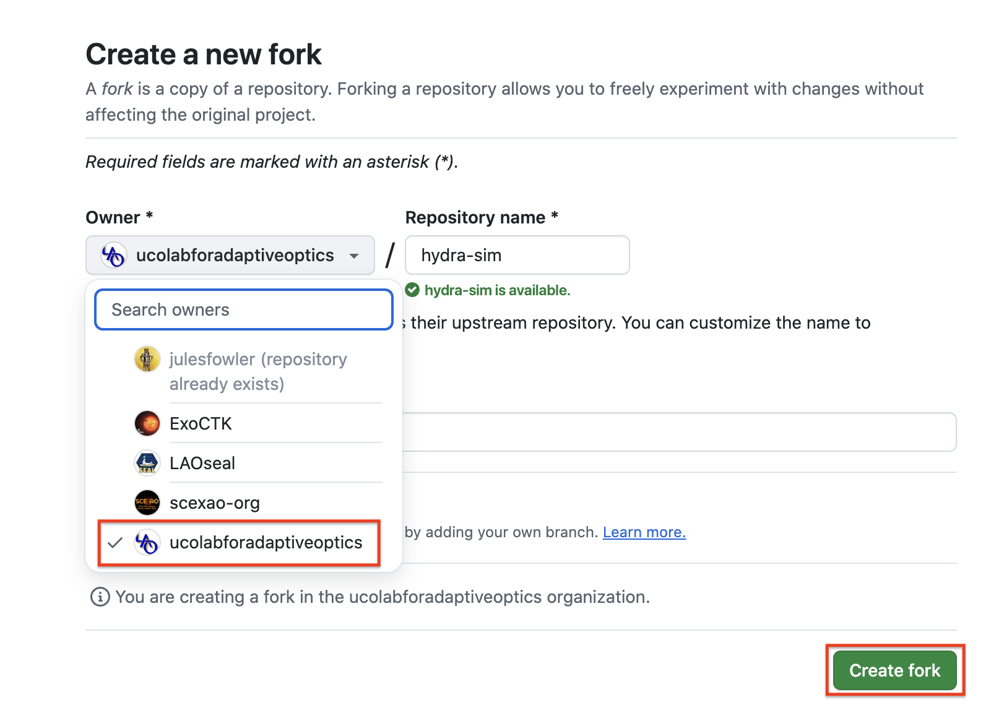
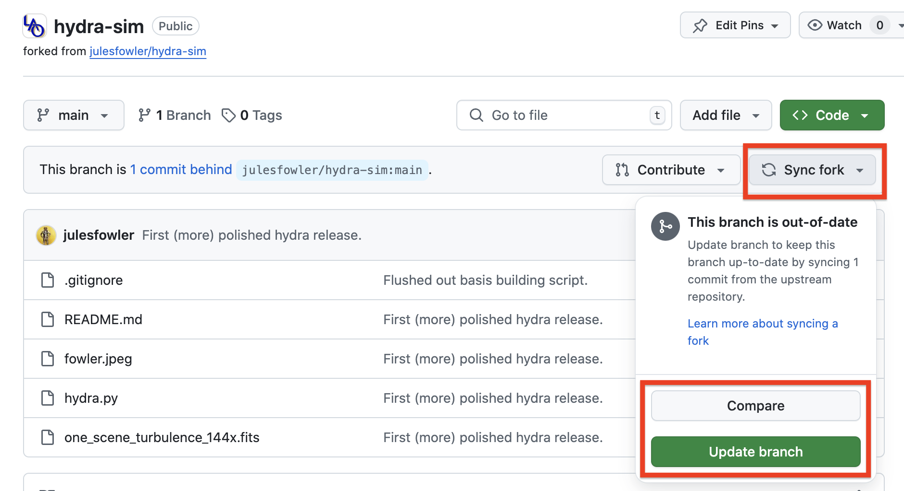
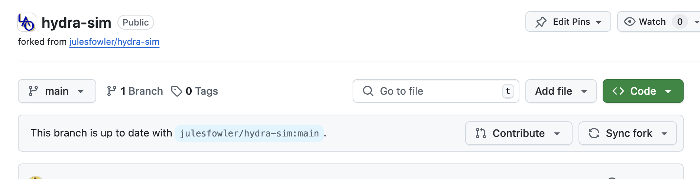

If we start with an existing repository (for example, I made [this
repo](https://github.com/julesfowler/hydra-sim) for my
april fool's day paper):

there's a big inviting button to fork the repo. When you do that, you are
prompted to choose an organization, and then just click the fork button. 

Notice that there are now two version of this repo, one at
``git@github.com:julesfowler/hydra-sim.git`` and another at
``git@github.com:ucolabforadaptiveoptics/hydra-sim.git``. 

Say I make an update to this repository, now when we go to the fork it will show
that it is one commit behind: 

by clicking the ``sync fork`` button I have the options to compare (check
my fork against the one we are keeping under the lab organization) and
eventually update the fork to match the original code. 

Once that's done, the same page will now show we are up to date with the
original code, and that update will be reflected in the new code. 

